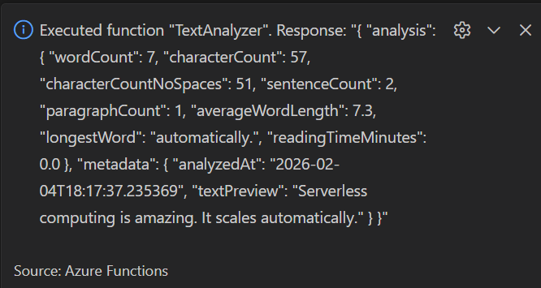

# Lab 1 26W_CST8917 Serverless Applications

## Brief instructions on how to run the project locally (environment variables needed, etc.)

### Student: Olga Durham
### St#: 040687883

---

## Part 1 & Part 2 - Prerequisites & Update Azure Functions Core Tools

Required Software & Azure Functions Core Tools

*Figure 1: Python 3.12.4; Azure Functions Core Tools 4.6.0*\

## Part 3 - Create the Local Function Project

### Create New Project

A local Azure Functions project with an HTTP-triggered function was created successfully using Python.

*Figure 2: Azure Functions project structure generated by VS Code.*\

### Configure Project Settings

The project settings were configured according to the lab instructions, including the correct Python interpreter, runtime version, and authorization level.

The project structure includes all required configuration files such as `host.json`, `function_app.py`, `requirements.txt`, and `local.settings.json`.

The HTTP-triggered function was executed locally and tested successfully using a query string parameter.

*Figure 3: Successful execution of the HTTP-triggered Azure Function using a query string parameter.*\

### Configure Local Storage

Local storage was configured using Azurite by setting `AzureWebJobsStorage` to `UseDevelopmentStorage=true` in `local.settings.json`. This allows the Azure Functions runtime to run locally without connecting to a real Azure Storage account.

*Figure 4: Local storage configured using Azurite via `UseDevelopmentStorage=true` in `local.settings.json`.*\

## Part 4 - Start the Azurite Storage Emulator

*Figure 5: Azurite storage emulator running locally in Visual Studio Code.*\

## Part 5 - Run and Test the Function Locally

The Azure Functions host was started locally using Azure Functions Core Tools.  
The `HttpExample` function endpoint was generated at:

`http://localhost:7071/api/HttpExample`

The function was tested in a browser using a query string parameter:

`http://localhost:7071/api/HttpExample?name=Azure`

The response returned a personalized message, confirming the HTTP trigger works locally.

*Figure 6: Core Tools running locally and exposing the HttpExample endpoint.*

*Figure 7: Successful GET request to HttpExample using a query string parameter.*

## Part 6 - Implement the Text Analyzer Function

The default `HttpExample` function was replaced with a new HTTP-triggered function named `TextAnalyzer`.  
After updating `function_app.py`, the local endpoint changed to:

`http://localhost:7071/api/TextAnalyzer`

The function was tested locally using a query string parameter (`text`) and returned JSON analysis results.

*Figure 8: TextAnalyzer code.*\

*Figure 9: TextAnalyzer endpoint.*\

*Figure 10: TextAnalyzer response.*\

## Part 7 - Sign in to Azure

Visual Studio Code successfully connected to Azure, and the **Azure for Students** subscription was selected in the Azure extension.

*Figure 11: Azure for Students subscription visible in Visual Studio Code, confirming successful Azure authentication.*\

## Part 8 - Create a Function App in Azure

A new Azure Function App was created using the Azure Functions extension in Visual Studio Code with advanced configuration options.  
The Function App was created using `Python 3.12`. When using the `consumption` plan, the operating system is automatically set to `Linux`.

The resource creation process was monitored using the `Azure Activity Log`, and the Function App appeared successfully under the `Azure for Students` subscription.

*Figure 12: Azure Function App successfully created and visible in Visual Studio Code.*\

## Part 9 - Deploy to Azure

The function was deployed to the Azure Function App (`olga-func-lab1`) using the VS Code Azure Functions extension.  
After deployment, the `TextAnalyzer` function was successfully discovered and appeared under the Function App in Azure.

The deployed function was tested using the public HTTPS endpoint and returned the expected JSON analysis output.

*Figure 13: TextAnalyzer function appears under the deployed Function App in Azure (trigger discovery successful).*\

*Figure 14: Successful execution of TextAnalyzer from the Azure-hosted endpoint.*\

To ensure the Python v2 function was discovered correctly after deployment, worker indexing was enabled using an application setting in the Azure Portal.

*Figure 15: Application setting AzureWebJobsFeatureFlags = EnableWorkerIndexing configured in the Azure Portal to enable worker indexing for Python v2 functions.*\

## Part 10 - Test the Deployed Function

The deployed `TextAnalyzer` function was executed directly from Visual Studio Code using the Azure Functions extension.  
A `JSON` request body was submitted, and the function returned the expected text analysis results, confirming successful cloud execution.

*Figure 16: Successful execution of the deployed TextAnalyzer function using the “Execute Function Now” option in Visual Studio Code.*\

---

## Part 2 - Persist Analysis Results to Azure Database

---

## Part 11 - Research Azure Database Options

### Investigate Azure Database Services

**Azure Cosmos DB** is a globally distributed NoSQL database service designed for modern, scalable applications. It supports multiple data models, including the Core (SQL) API for JSON documents, MongoDB API, Table API, and Cassandra API. One of its key features is the serverless tier, which uses a pay-per-request pricing model where Azure automatically manages capacity and scaling, and charges only for the database operations that are executed. Azure Cosmos DB is particularly well suited for serverless architectures because it offers native JSON storage, a schema-less design, automatic scaling, and strong integration with Azure Functions. Typical use cases include storing event data, application logs, API results, and data generated by serverless applications.

**Azure Table Storage** is a simple key-value storage service optimized for large volumes of structured, non-relational data. Compared to Azure Cosmos DB, it offers more limited querying capabilities, lacks advanced indexing, and uses a flatter data model. It is most appropriate for scenarios that require very simple lookups using `PartitionKey` and `RowKey`. However, Azure Table Storage is not well suited for complex or nested JSON data and does not support analytics-style queries efficiently.

**Azure SQL Database** is a fully managed relational database service based on the SQL Server engine. It is best suited for applications that require strong relationships between data entities, complex joins, strict schema enforcement, and transactional consistency. While powerful, Azure SQL Database is not an ideal choice for storing JSON-based analysis results in this scenario, as it introduces unnecessary complexity through schema design and higher management overhead compared to NoSQL alternatives.

**Azure Blob Storage** is an object storage service primarily intended for storing unstructured data such as files and binary objects. Although it is technically possible to store JSON files in Blob Storage, it does not provide native querying or indexing capabilities, which makes it inefficient for data analysis or querying historical results. Azure Blob Storage is best used for archives, backups, media files, and raw data storage rather than as a database for structured or semi-structured analysis results.

### Evaluate and Choose

Because the Text Analyzer produces JSON output, Azure Cosmos DB is a natural choice since it natively stores and queries JSON documents without requiring a fixed schema. Its serverless pricing model and free tier make it cost-effective for student projects and low-usage serverless applications. Azure Cosmos DB aligns well with serverless principles by automatically scaling and integrating easily with Azure Functions through its Python SDK. In addition, its SQL-style query support allows efficient querying of historical analysis results. Based on these factors, Azure Cosmos DB (serverless) was selected as the most suitable database option.

### Document the Decision

[DATABASE_CHOICE.md](/DATABASE_CHOICE.md)