# Lab 1 26W_CST8917 Serverless Applications

## Brief instructions on how to run the project locally (environment variables needed, etc.)

### Student: Olga Durham
### St#: 040687883

---

## Prerequisites

Required Software & Azure Functions Core Tools

*Figure 1: Python 3.12.4; Azure Functions Core Tools 4.6.0*\
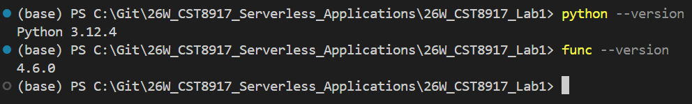

## Local Function Project

### Create New Project

A local Azure Functions project with an HTTP-triggered function was created successfully using Python.

*Figure 2: Azure Functions project structure generated by VS Code.*\
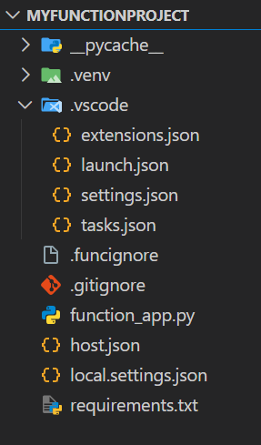

### Configure Project Settings

The project settings were configured according to the lab instructions, including the correct Python interpreter, runtime version, and authorization level.

The project structure includes all required configuration files such as `host.json`, `function_app.py`, `requirements.txt`, and `local.settings.json`.

The HTTP-triggered function was executed locally and tested successfully using a query string parameter.

*Figure 3: Successful execution of the HTTP-triggered Azure Function using a query string parameter.*\

### Configure Local Storage

Local storage was configured using Azurite by setting `AzureWebJobsStorage` to `UseDevelopmentStorage=true` in `local.settings.json`. This allows the Azure Functions runtime to run locally without connecting to a real Azure Storage account.

*Figure 4: Local storage configured using Azurite via `UseDevelopmentStorage=true` in `local.settings.json`.*\

## Start the Azurite Storage Emulator

*Figure 5: Azurite storage emulator running locally in Visual Studio Code.*\
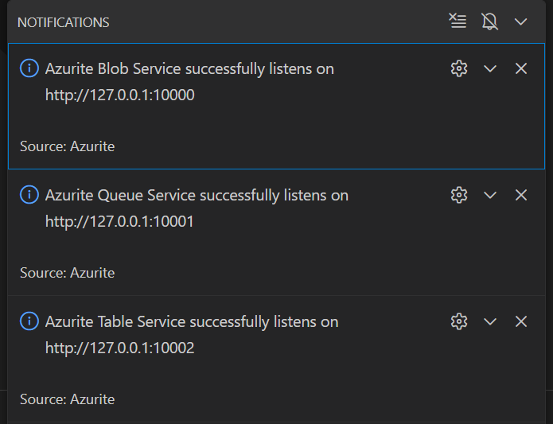

## Run and Test the Function Locally

The Azure Functions host was started locally using Azure Functions Core Tools.  
The `HttpExample` function endpoint was generated at:

`http://localhost:7071/api/HttpExample`

The function was tested in a browser using a query string parameter:

`http://localhost:7071/api/HttpExample?name=Azure`

The response returned a personalized message, confirming the HTTP trigger works locally.

*Figure 6: Core Tools running locally and exposing the HttpExample endpoint.*
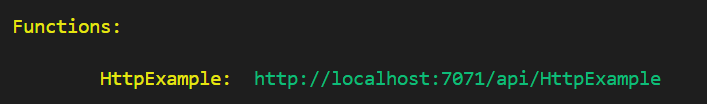

*Figure 7: Successful GET request to HttpExample using a query string parameter.*
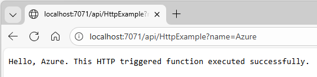

## Implement the Text Analyzer Function

The default `HttpExample` function was replaced with a new HTTP-triggered function named `TextAnalyzer`.  
After updating `function_app.py`, the local endpoint changed to:

`http://localhost:7071/api/TextAnalyzer`

The function was tested locally using a query string parameter (`text`) and returned JSON analysis results.

*Figure 8: TextAnalyzer code.*\
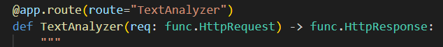

*Figure 9: TextAnalyzer endpoint.*\
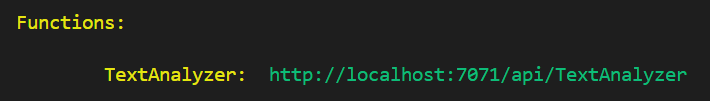

*Figure 10: TextAnalyzer response.*\
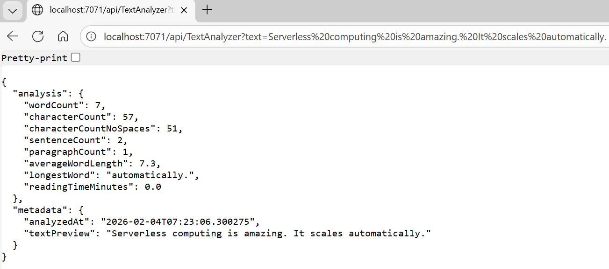

## Sign in to Azure

Visual Studio Code successfully connected to Azure, and the **Azure for Students** subscription was selected in the Azure extension.

*Figure 11: Azure for Students subscription visible in Visual Studio Code, confirming successful Azure authentication.*\
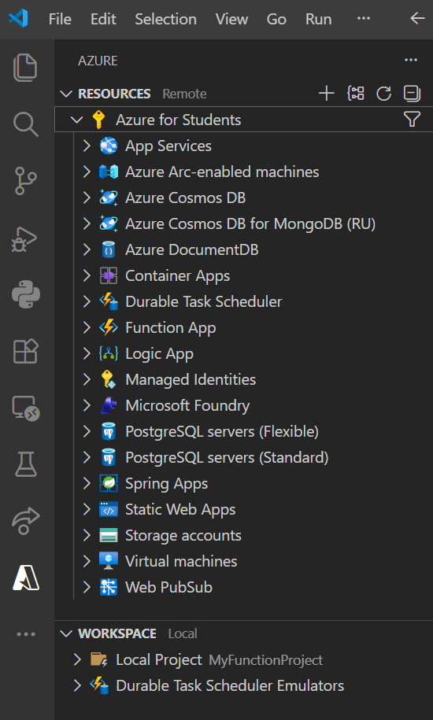

## Create a Function App in Azure

A new Azure Function App was created using the Azure Functions extension in Visual Studio Code with advanced configuration options.  
The Function App was created using `Python 3.12`. When using the `consumption` plan, the operating system is automatically set to `Linux`.

The resource creation process was monitored using the `Azure Activity Log`, and the Function App appeared successfully under the `Azure for Students` subscription.

*Figure 12: Azure Function App successfully created and visible in Visual Studio Code.*\
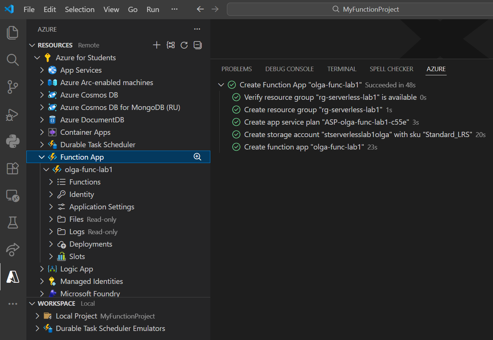

## Deploy to Azure

The function was deployed to the Azure Function App (`olga-func-lab1`) using the VS Code Azure Functions extension.  
After deployment, the `TextAnalyzer` function was discovered successfully and appeared under the Function App in Azure.

The deployed function was tested using the public HTTPS endpoint and returned the expected JSON analysis output.

*Figure 13: TextAnalyzer function appears under the deployed Function App in Azure (trigger discovery successful).*\
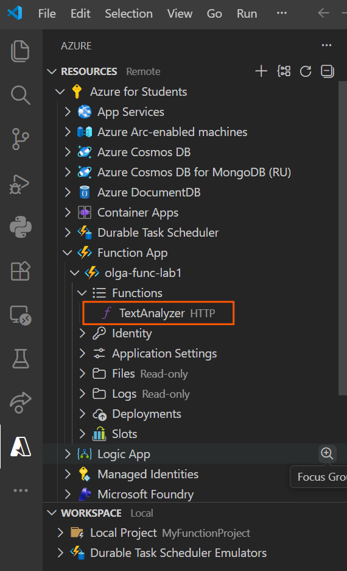

*Figure 14: Successful execution of TextAnalyzer from the Azure-hosted endpoint.*\
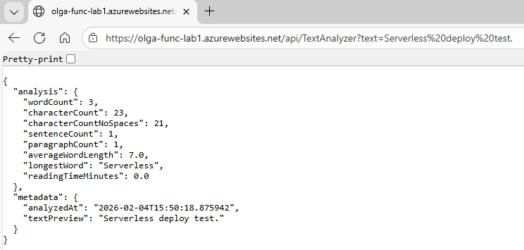

To ensure the Python v2 function was discovered correctly after deployment, worker indexing was enabled using an application setting in the Azure Portal.

*Figure 15: Application setting AzureWebJobsFeatureFlags = EnableWorkerIndexing configured in the Azure Portal to enable worker indexing for Python v2 functions.*\
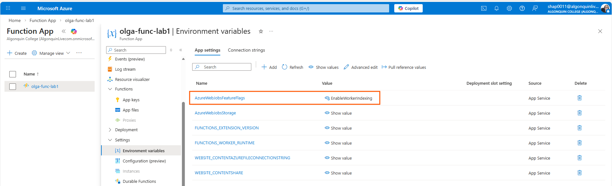